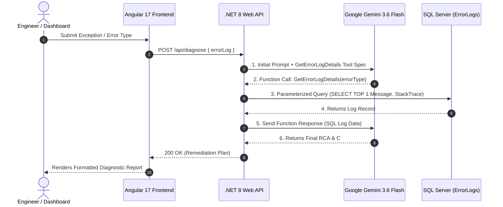

# Autonomous .NET Incident Remediation Agent

[](https://dotnet.microsoft.com/)
[](https://angular.dev/)
[](https://www.microsoft.com/sql-server)
[](https://ai.google.dev/)
[](LICENSE)

An enterprise-grade, self-healing incident remediation platform that combines a **.NET 8 Web API backend**, an **Angular 17 corporate dashboard**, **SQL Server data access**, and **Google Gemini AI with Function Calling**. The agent autonomously inspects application error logs, queries SQL database records, performs Root Cause Analysis (RCA), and generates C# code fixes in real-time.

---

## 🏗 System Architecture



---

## ✨ Key Technical Features

### 🧠 Autonomous Agentic Tool Calling
- Implements a two-step conversational function execution loop using Google's `gemini-3.6-flash` REST API.
- The AI autonomously determines when to invoke the custom `GetErrorLogDetails` tool based on incoming exception logs.

### 🛡 Enterprise Security & SQL Injection Prevention
- **Parameterized SQL Queries**: All database access via `DatabaseTool` utilizes strictly typed `SqlCommand` parameter binding (`@errorType`) with zero string concatenation or interpolation.
- **Secrets Management**: Sensitive credentials (Gemini API keys, database connection strings) are managed out-of-tree via `.NET Secret Manager` (`dotnet user-secrets`) and Environment Variables.
- **Strict CORS Policy**: Restricted cross-origin resource sharing configured to allow only authorized frontend origin endpoints (`http://localhost:4200`).

### ⚡ Enterprise Resilience & Audit Logging
- **IP-Based Rate Limiting**: Built-in ASP.NET Core `FixedWindowLimiter` middleware enforcing a limit of **10 requests per minute per IP** to prevent API abuse.
- **Serilog Structured Logging**: Enterprise request logging with daily rolling text file sinks (`logs/api-log-.txt`) providing complete audit trails for security and AI invocations.

### 🎨 Modern Angular 17 Frontend
- Built with **Angular 17 Standalone Components** and reactive architecture.
- **Dynamic Environment Swapping**: Environment files (`environment.ts` and `environment.prod.ts`) automatically replace API URLs during build.
- **Defensive UI Hardening**: Guard clauses for input validation, live loading state indicators, and fault-tolerant HTTP error handling.

---

## 📂 Project Directory Structure

```text
Autonomous-Remediation-Agent/
├── IncidentRemediationAgent.API/       # .NET 8 Web API Backend
│   ├── Controllers/
│   │   └── IncidentController.cs       # REST Endpoint (/api/diagnose)
│   ├── Services/
│   │   ├── IAgentService.cs            # Agent Service Interface
│   │   ├── GeminiAgentService.cs       # Gemini AI Function Calling Loop
│   │   └── DatabaseTool.cs             # Parameterized SQL Server Data Access
│   ├── Properties/
│   │   └── launchSettings.json
│   ├── appsettings.json                # Sanitized Configuration Shell
│   └── Program.cs                      # Dependency Injection, Serilog, CORS, & Rate Limiting
│
└── incident-remediation-agent-ui/      # Angular 17 Frontend Dashboard
    ├── src/
    │   ├── app/
    │   │   ├── dashboard/              # Corporate Remediation Dashboard Component
    │   │   ├── services/
    │   │   │   └── diagnostic.service.ts # Angular HTTP Diagnostic Service
    │   │   ├── app.component.ts
    │   │   └── app.config.ts
    │   └── environments/
    │       ├── environment.ts          # Dev Environment Config
    │       └── environment.prod.ts     # Production Environment Config
    ├── angular.json                    # Angular CLI Workspace Configuration
    └── package.json
```

---

## 🚀 Getting Started

### Prerequisites

- **.NET 8.0 SDK** ([Download](https://dotnet.microsoft.com/download/dotnet/8.0))
- **Node.js 18+ & npm** ([Download](https://nodejs.org/))
- **Microsoft SQL Server** (LocalDB, SQLEXPRESS, or Server instance)
- **Google Gemini API Key** ([Get Key](https://aistudio.google.com/))

---

### Database Setup

Run the following script on your SQL Server instance to create the target database and sample `ErrorLogs` table:

```sql
CREATE DATABASE IncidentAgentDb;
GO

USE IncidentAgentDb;
GO

CREATE TABLE ErrorLogs (
    Id INT IDENTITY(1,1) PRIMARY KEY,
    ErrorType NVARCHAR(255) NOT NULL,
    Message NVARCHAR(MAX) NOT NULL,
    StackTrace NVARCHAR(MAX) NOT NULL,
    CreatedAt DATETIME DEFAULT GETDATE()
);
GO

INSERT INTO ErrorLogs (ErrorType, Message, StackTrace)
VALUES (
    'System.NullReferenceException',
    'Object reference not set to an instance of an object.',
    'at IncidentAgent.API.Controllers.UserController.Get() in UserController.cs:line 42'
);
GO
```

---

### Backend Setup (.NET 8 API)

1. Navigate to the backend directory:
   ```bash
   cd IncidentRemediationAgent.API
   ```

2. Initialize Secret Manager and configure credentials:
   ```bash
   dotnet user-secrets init
   dotnet user-secrets set "GeminiAI:ApiKey" "YOUR_GEMINI_API_KEY"
   dotnet user-secrets set "ConnectionStrings:DefaultConnection" "Server=YOUR_SERVER;Database=IncidentAgentDb;Trusted_Connection=True;TrustServerCertificate=True;"
   ```

3. Build and run the Web API:
   ```bash
   dotnet build
   dotnet run
   ```
   The backend API will start at `http://localhost:5235`.

---

### Frontend Setup (Angular 17 UI)

1. Navigate to the frontend directory:
   ```bash
   cd incident-remediation-agent-ui
   ```

2. Install dependencies:
   ```bash
   npm install
   ```

3. Start the development server:
   ```bash
   npx ng serve --port 4200
   ```

4. Open your browser and navigate to:
   ```text
   http://localhost:4200
   ```

---

## 🛠 Production Deployment Build

To generate the optimized production bundle for deployment:

```bash
cd incident-remediation-agent-ui
npx ng build --configuration production
```

The output assets will be generated in `dist/incident-remediation-agent-ui/`.

---

## 📜 License

Distributed under the MIT License. See `LICENSE` for more information.
